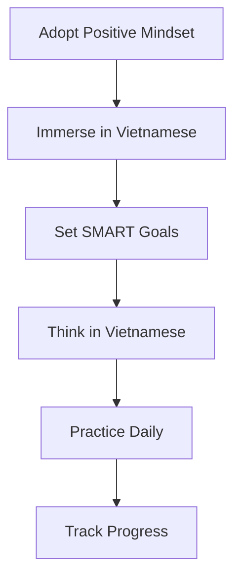

👋 Welcome to your Vietnamese learning journey! This guide will help you adopt the right mindset, immerse yourself in the language, and set meaningful goals to achieve fluency faster.

<!--more-->

## Why Learn Vietnamese?

Vietnamese is a vibrant, tonal language spoken by over 90 million people. Learning it opens doors to rich cultural experiences, travel, and meaningful connections. By starting with the right approach, you’ll find Vietnamese approachable and rewarding.


**Mindset Matters**: Believe Vietnamese is learnable, its patterns and tones are just new skills to master!


## The Right Approach

{}

### Adopt the Right Mindset

Success in language learning begins with a positive attitude:

- **Believe it’s easy**: View Vietnamese as a system of patterns you can learn, not a barrier.
- **Embrace mistakes**: Mistakes are stepping stones to fluency.
- **Think in Vietnamese**: Label objects around you to build direct associations.

### Immerse Yourself from Day 1

Immersion is key to natural language acquisition:

- **Listen to native speakers**: Practice speaking to native speakers to learn their accents.
- **Surround yourself**: Immerse yourself in the Vietnamese culture by visiting local places.
- **Mimic tones**: Vietnamese is tonal—practice mimicking native speakers to master the six tones.

### Set Meaningful Goals

Clear, emotional goals keep you motivated:

- **Define your “why”**: Are you learning to connect with locals, travel, or work in Vietnam?
- **Use SMART goals**:
  - **Specific**: “Order food in Vietnamese.”
  - **Measurable**: “Learn 50 food-related words.”
  - **Achievable**: “Practice 10 minutes daily.”
  - **Relevant**: Ties to your “why.”
  - **Time-bound**: “In 2 months.”
- **Track progress**: Use a journal or app to log milestones.


**Example Goal**: “Hold a 5-minute conversation about daily activities in Vietnamese within 3 months.”


### Think in Vietnamese

Avoid translating, think directly in Vietnamese to build fluency:

- **Label your environment**: Stick notes on objects.
- **Narrate your day**: Describe actions in Vietnamese.
- **Use visual cues**: Associate words with images, not English translations.

{}

## Your Vietnamese Learning Roadmap

## Next Steps

Ready to dive in? Start with our comprehensive guide to rapid language acquisition:


  


