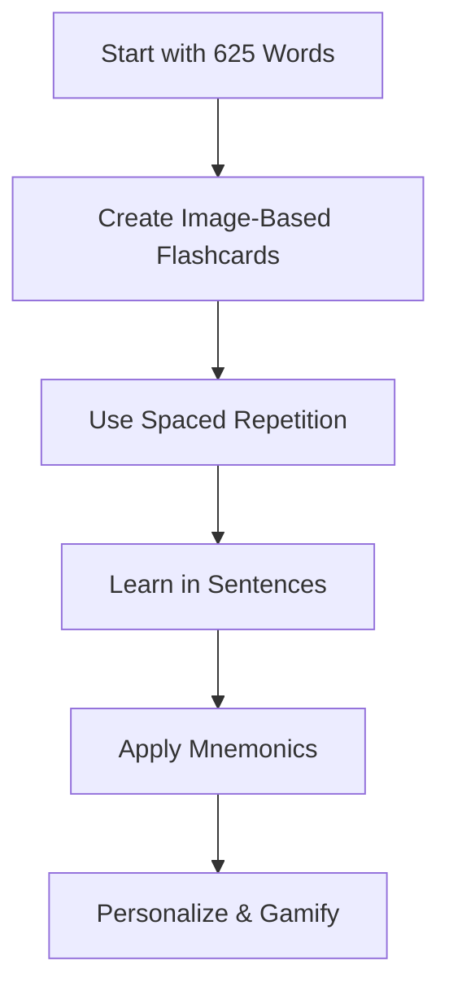

Building a robust vocabulary is the cornerstone of language fluency. This guide shows you how to learn the 625 most common words in your target language using image-based flashcards, spaced repetition systems (SRS), and mnemonic techniques. By focusing on visual, high-frequency words and contextual learning, you’ll retain vocabulary faster and more effectively.

## Why Focus on Essential Vocabulary?

A strong vocabulary enables you to express ideas clearly and understand native speakers. Key benefits include:

- **Faster fluency**: The 625 words cover ~85% of everyday conversations.
- **Stronger retention**: Visual and emotional associations make words stick.
- **Efficient learning**: Spaced repetition optimizes review time.


**Pro Tip**: Focus on concrete, visual words over abstract ones for easier recall!


## Step 1: Master the 625 Essential Words

The 625 most common words are grouped into 89 clusters for efficient learning. These are high-frequency, visual words tailored to Vietnamese.

- **How it’s organized**:
  - Not by categories (e.g., colors), but by thematic clusters (e.g., “red apple” and “delicious” together).
  - Examples: “water,” “cellphone,” “dog” instead of “and,” “of.”
- **Sample Word Groups**:

| Group | Words | Visual Cue |
|-------|-------|------------|
| 1     | Red, Apple, Delicious | Picture a shiny red apple. |
| 2     | Water, Glass, Cold    | Imagine a cold glass of water. |
| 3     | Dog, Run, Park        | Visualize a dog running in a park. |

- **How to learn**:
  1. Study 7-10 words daily (~1-2 groups).
  2. Use SRS for daily review.
  3. Spend 1-2 hours daily mixing listening, speaking, and review.

## Step 2: Create Image-Based Flashcards

Avoid translations and build direct associations with personalized flashcards:

- **Components**:
  - **Image**: A vivid picture.
  - **Word**: The target language word.
  - **Audio**: A native speaker’s pronunciation.
  - **Sentence**: A simple example.
- Gamify flashcards with funny or personal images (e.g., your dog).

## Step 3: Use Spaced Repetition Systems (SRS)

SRS optimize retention by scheduling reviews based on your memory strength:

- **How to use**:
  1. Create flashcards with images, audio, and sentences.
  2. Review daily, focusing on words you struggle with.
  3. Let the SRS algorithm adjust review intervals.
- **Advanced Tip**: Combine with the Goldlist Method, write words in a notebook and review passively every 2 weeks.

## Step 4: Learn in Context

Isolated words are harder to retain. Instead, learn words in meaningful sentences:

- **Why it works**: Sentences provide context, grammar patterns, and emotional connections.
- Spot patterns in songs or dialogues to reinforce vocabulary.

## Step 5: Leverage Mnemonics and Emotions

Make words memorable with vivid associations:

- **Mnemonics**: Create a story or image.
- **Emotions**: Tie words to personal experiences.
- **Gestures**: Use body language (e.g., point to your mouth for “eat”) to reinforce meaning.

## Step 6: Make It Fun and Personal

Engage your passions to stay motivated:

- Learn words tied to your interests.

## Your Vocabulary Learning Roadmap

## Advanced Vocabulary

Once you master the 625 words, expand with:

- High-frequency words from sentence databases.
- Words specific to your goals (e.g., travel or work terms).
- Continue using SRS and contextual sentences.

## Conclusion

Vocabulary learning doesn’t have to be daunting. Whether you prefer the Goldlist Method or tech-driven spaced repetition, these techniques will help you build a strong foundation for fluency.